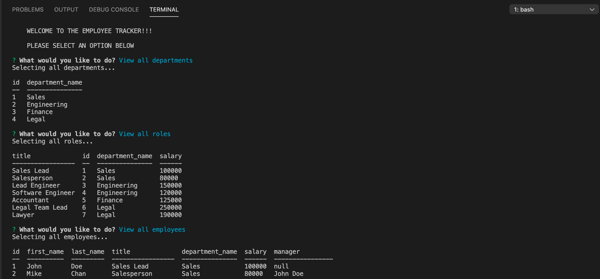

# employee-tracker

## Description

An employee tracking app that uses inquirer to prompt user for various forms of information and display info in the console. The app uses a mySQL database to store the various employee data.

## Table of Contents

* [Installation](#installation)
* [Usage](#usage)
* [Credits](#credits)
* [License](#license)

## Usage 

* Download source files
* Run npm install to install the dependencies
* Open up mySQL2 and run the schema.sql and seeds.sql file to generate data into the database
* run npm start to start the application

## Contributing

All the code for this project was written by Jaydon Goodrich

## License

Code released under the [Unlicense](http://unlicense.org/)

****

## Questions
For further questions I can be reached at:

GitHub: [Jaydon-Goodrich](https://github.com/Jaydon-Goodrich)

Email: JaydonGoodrich@gmail.com

Further Instructions: 

You can also reach out on the following social media platforms:

Instagram: Jaydon-Goodrich

Facebook: Jaydon-Goodrich

LinkedIn: Jaydon-Goodrich
    
## Reference
[Link to Youtube showing this project](https://youtu.be/q0y0QvZyl7I)

